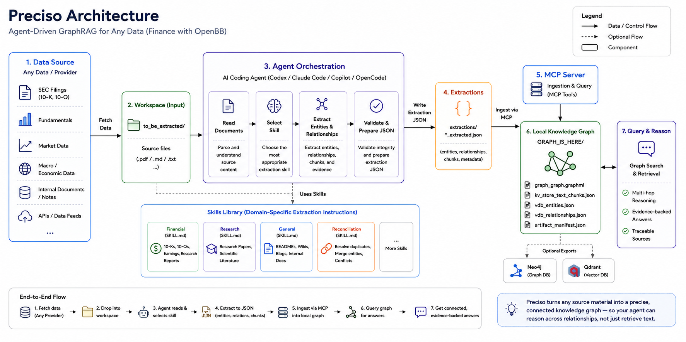
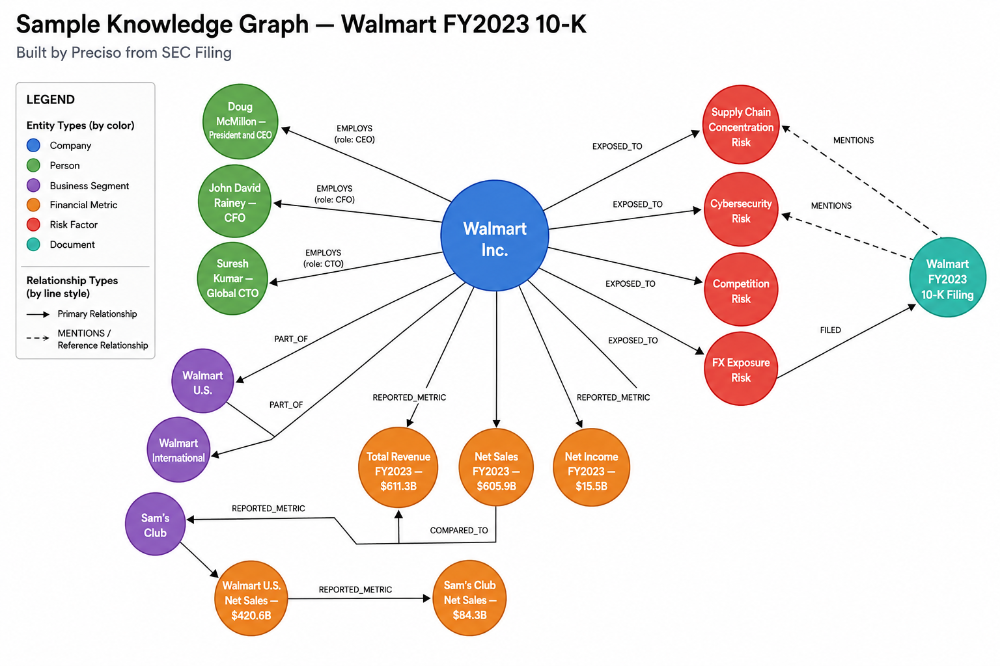

<div align="center">
  <h1>Preciso</h1>
  <p><strong>Precise knowledge graphs from your documents.</strong></p>
  <p><em>Named after Bruno Fernandes. Every pass lands exactly where it needs to.</em></p>
  <p>
    
    
    
    
  </p>
  <p>
    
    
    
  </p>
</div>

---

Most RAG tools retrieve documents.
Preciso builds a **knowledge graph** — so your agent can reason across connections, not just find similar text.

```
Documents → Agent picks skill → Extraction JSON → MCP ingest → Local graph
```

Drop source files into `to_be_extracted/`. An agent reads them, extracts entities and relationships using domain-specific skills, and persists a queryable knowledge graph locally in `GRAPH_IS_HERE/`. No cloud required. No pipeline to configure.

---

## Why GraphRAG Over Regular RAG?

**Regular RAG:**
```
"What are Apple's risk factors?"
→ returns the Risk Factors section text
```

**Preciso:**
```
"What are Apple's risk factors and which executives are responsible for managing them?"
→ traverses RISK_FACTOR → EXPOSED_TO → COMPANY → EMPLOYS → PERSON
→ returns a connected answer with evidence
```

The graph makes multi-hop reasoning possible.

---

## Benchmark Results

Tested on 23 financial QA questions from Walmart FY2022 + FY2023 10-K filings, scored on four dimensions:

| Metric             | Score     |
|--------------------|-----------|
| Context Relevancy  | 0.983     |
| Faithfulness       | **1.000** |
| Answer Correctness | 0.960     |
| Precision          | 0.910     |
| **Preciso Score**  | **95 / 100** |

- **Hallucinations:** 0 / 23
- **Failed questions:** 0 / 23

| System                            | Score     |
|-----------------------------------|-----------|
| **Preciso**                       | **95.4%** |
| GPT-4 + long context (79k tokens) | ~79%      |
| GPT-4 + standard RAG              | ~19%      |

See [docs/eval-guide.md](docs/eval-guide.md) for full methodology and multi-hop breakdowns.

---

## Quickstart (3 Minutes)

### 1. Clone and install

```bash
git clone https://github.com/Preciso-GR/preciso-graphrag
cd preciso-graphrag
python3 -m venv .venv
source .venv/bin/activate
pip install -r requirements.txt
```

> Requires Python 3.11+, a local virtualenv at `.venv`, and the agent opened from the repo root.

### 2. Drop files into `to_be_extracted/`

Best inputs: `.md`, `.txt`, README files, wiki exports, notes.

> For PDFs: convert to `.md` first, or use Claude Code / Codex which can read PDFs natively.

### 3. Run this prompt in your agent

Open Codex, Claude Code, Copilot, or OpenCode from the repo root.

**Quick version:**
```
Process the files in to_be_extracted/ using Preciso.
```

<details>
<summary>Full agent prompt (recommended for first run)</summary>

```
Call get_server_status().
If overall is ready, proceed.
If overall is degraded, explain what is degraded, what still works,
and ask whether to proceed or fix first.
Read the files in to_be_extracted/.
Choose the most appropriate extraction skill from the skills folder for each file.
Extract entities, relationships, and chunks into extractions/{source_name}_extracted.json.
Validate that every source_id maps to a real chunk_id and that all relationships
reference defined entities.
If the extraction looks clean, call ingest_from_file for each generated extraction file.
If you find duplicate entities, orphaned relationships, or conflicts,
use the reconciliation skill before ingestion.
Confirm the graph artifacts written to GRAPH_IS_HERE/ and summarize what was ingested.
```

</details>

---

## How It Works



Six steps, always in this order:

| Step | Who        | What happens                                          |
|------|------------|-------------------------------------------------------|
| 1    | You        | Drop source files into `to_be_extracted/`             |
| 2    | Agent      | Reads the files                                       |
| 3    | Agent      | Selects the right skill from `skills/`                |
| 4    | Agent      | Writes `extractions/{source_name}_extracted.json`     |
| 5    | Agent      | Calls the MCP ingestion tool                          |
| 6    | Preciso    | Persists graph in `GRAPH_IS_HERE/` — queryable immediately |

### Folder Contract

```
to_be_extracted/    ← drop your source files here (.md, .txt)
skills/             ← agent reads these to know how to extract
extractions/        ← agent writes extraction JSON here
GRAPH_IS_HERE/      ← graph artifacts live here (source of truth)
docs/               ← guides and architecture reference
evals/              ← benchmark test cases and results
```

---

## Skill Selection

| Skill | Path | Use When |
|-------|------|----------|
| Financial | `skills/Financial-Graph-Extraction/SKILL.md` | 10-Ks, 10-Qs, earnings calls, analyst reports |
| Research | `skills/Research-paper-graph-extraction-skill/SKILL.md` | Research papers, scientific literature, academic corpora |
| General | `skills/General-graph-extraction-skill/SKILL.md` | Codebases, READMEs, wikis, internal docs |
| Reconciliation | `skills/Reconciliation-Subagent-Skill/SKILL.md` | Cleanup of existing extraction JSON only |
| Eval | `skills/Eval-Skill/SKILL.md` | Evaluating a built graph — not for extraction |

---

## MCP Tools

| Tool | Description |
|------|-------------|
| `get_server_status` | Runtime health check — call before anything |
| `ingest_from_file` | Ingest a completed extraction JSON file |
| `reingest_from_file` | Retry ingestion without re-extracting |
| `ingest_graph_tool` | Ingest an inline extraction payload |
| `ingest_with_reconciliation_tool` | Ingest after reconciliation subagents finish |
| `query_graph_tool` | Query the persisted graph |
| `export_graph_to_neo4j` | Optional: push graph structure to Neo4j |
| `export_vectors_to_qdrant` | Optional: push vector artifacts to Qdrant |

### Runtime Status

Always call `get_server_status()` first. It reports embedding mode, graph health, and LLM config before any work starts.

<details>
<summary>Healthy response example</summary>

```json
{
  "overall": "ready",
  "warnings": [],
  "embedding": {
    "mode": "local",
    "provider": "ollama",
    "model": "mxbai-embed-large",
    "dimension": 768,
    "status": "active"
  },
  "graph": {
    "storage": "networkx",
    "entities": 142,
    "relationships": 281,
    "documents_ingested": 1,
    "chunks": 96
  },
  "llm": {
    "configured": true,
    "status": "active"
  }
}
```

</details>

<details>
<summary>Degraded response example</summary>

```json
{
  "overall": "degraded",
  "warnings": [
    "Fallback embeddings active — graph creation works, vector search quality reduced.",
    "LLM summarization not configured — extraction works, summary generation skipped."
  ],
  "embedding": { "mode": "fallback", "status": "degraded" },
  "llm": { "configured": false, "status": "inactive" }
}
```

</details>

If `overall` is `degraded`, the agent explains what still works and asks before proceeding. It never silently continues.

---

## What You Can Query After Ingestion

```
"What are Apple's top 5 disclosed risk factors?"
"Which executives are connected to the supply chain risks?"
"What metrics declined year over year?"
"How does the Services segment relate to overall revenue?"
```

The graph connects entities across document sections so your agent gets reasoned answers, not retrieved chunks.



---

## Graph Artifacts

After ingestion the graph persists in `GRAPH_IS_HERE/` and is reusable across sessions:

```
GRAPH_IS_HERE/
├── graph_graph.graphml              ← most portable artifact
├── kv_store_text_chunks.json
├── kv_store_entity_chunks.json
├── kv_store_relation_chunks.json
├── vdb_entities.json
├── vdb_relationships.json
├── vdb_chunks.json
└── artifact_manifest.json
```

The most portable artifact is `graph_graph.graphml`. Copy the whole folder to move the graph to another machine.

---

## Downstream Exports (Optional)

<p>
  
  
</p>

`GRAPH_IS_HERE/` is always the source of truth. Neo4j and Qdrant are optional downstream copies — not storage backends.

```
Local graph (master) → optional → Neo4j copy
Local graph (master) → optional → Qdrant copy
```

Think of it like a Google Doc you export to PDF. The Doc is the real thing. The PDF is a snapshot for sharing. If you re-ingest locally, the local graph updates. Downstream copies do not auto-update — you re-export when ready.

<details>
<summary>Neo4j export config</summary>

```json
{
  "uri": "bolt://localhost:7687",
  "username": "neo4j",
  "password": "your-password",
  "database": "neo4j",
  "workspace": "default",
  "clear_existing": false
}
```

Required env vars: `GRAPHRAG_NEO4J_URI`, `GRAPHRAG_NEO4J_USERNAME`, `GRAPHRAG_NEO4J_PASSWORD`

</details>

<details>
<summary>Qdrant export config</summary>

```json
{
  "url": "http://localhost:6333",
  "api_key": null,
  "collection_prefix": "preciso",
  "workspace": "default",
  "clear_existing": false
}
```

Required env vars: `GRAPHRAG_QDRANT_URL`, optionally `GRAPHRAG_QDRANT_API_KEY`

</details>

See [docs/getting-started.md](docs/getting-started.md) for full export setup including `.env` configuration.

---

## MCP Setup

`.mcp.json` uses a repo-local launcher that finds the right Python automatically:

```json
{
  "mcpServers": {
    "graphrag-mcp": {
      "type": "stdio",
      "command": "/bin/sh",
      "args": ["scripts/mcp_launcher.sh"],
      "cwd": ".",
      "tools": ["*"]
    }
  }
}
```

---

## Manual Fallback

For users who want to drive ingestion and querying directly without an agent:

```bash
# Ingest an extraction file
python3 test/ingest_manual.py extractions/your_file_extracted.json

# Query the graph
python3 test/query_manual.py "What is Tim Cook's role?" mix

# Run reconciliation demo
python3 test/reconcile_manual.py
```

---

## Docs

| Guide | What it covers |
|-------|----------------|
| [docs/getting-started.md](docs/getting-started.md) | Full setup including embeddings and exports |
| [docs/skills-guide.md](docs/skills-guide.md) | How to use and write extraction skills |
| [docs/eval-guide.md](docs/eval-guide.md) | How to run evaluation and read results |
| [docs/architecture.md](docs/architecture.md) | How the system works internally |
| [docs/faq.md](docs/faq.md) | Common problems and fixes |

---

## Current Limitations

- Best input format is `.md` or `.txt` — PDF handling depends on external conversion or a native PDF-capable agent
- Retrieval quality depends on embedding configuration
- Neo4j and Qdrant exports require those services running externally
- Single-user local workflow — no built-in multi-user or shared graph support yet

---

## License

Licensed under the **Apache License, Version 2.0**. See [LICENSE](LICENSE) for full terms.


The extraction pipeline, skills system, MCP tooling, reconciliation layer, and evaluation framework are original work licensed under Apache 2.0.
